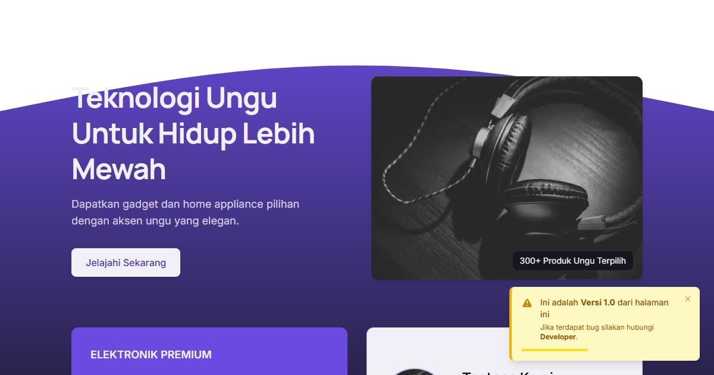

# LuxeElectro — Audio dengan Spesifikasi yang Ditulis Lengkap

LuxeElectro: headphone, earphone, DAC, dan speaker meja lini Luxe dengan lembar spesifikasi lengkap, kurva respons frekuensi, dan uji dengar 14 hari di rumah.

**Demo live:** https://landing-luxeelectro.vercel.app



> Template landing page untuk bisnis fiktif. Formulir di dalamnya hanya demo dan tidak mengirim data.

## Konsep

Bahasa rupa **Panel Spesifikasi**: gadget dan peralatan rumah premium ditampilkan lewat angka dan detail teknisnya.

## Halaman

- `/` — lini audio Luxe: panel spesifikasi, layanan, perlindungan, uji dengar 14 hari
- `/produk/[slug]` — lembar spesifikasi lengkap dan kurva respons frekuensi per perangkat
- `/bandingkan` — dua perangkat berdampingan dengan kurva ditumpuk

## Teknologi

- Next.js 15.5 (App Router) dan React 19
- Tailwind CSS v4
- JavaScript
- Font: Manrope, Inter (next/font)
- SEO: metadata per halaman, Open Graph, JSON-LD, sitemap.xml, dan robots.txt

## Kredit foto

Foto headphone di hero: ["Headphones Audio"](https://stocksnap.io/photo/headphones-audio-1Y69ONYCCZ) oleh Corey Blaz via StockSnap, lisensi CC0 (domain publik).

## Menjalankan secara lokal

```bash
npm install
npm run dev
```

Buka http://localhost:3000. Untuk build produksi: `npm run build` lalu `npm start`.

---

Bagian dari koleksi 17 template landing page di [PortalLanding](https://www.pintuweb.com/landing-page). Dibuat oleh [PintuWeb](https://www.pintuweb.com), jasa pembuatan website.
